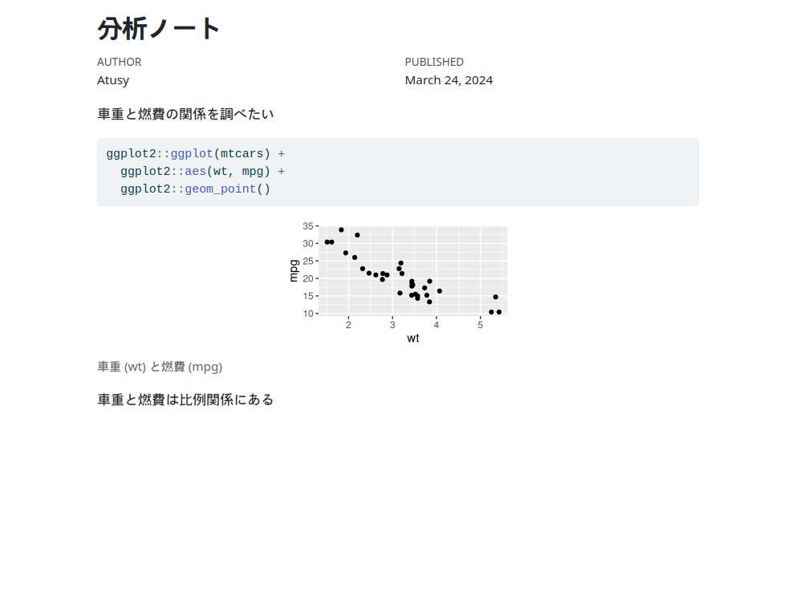
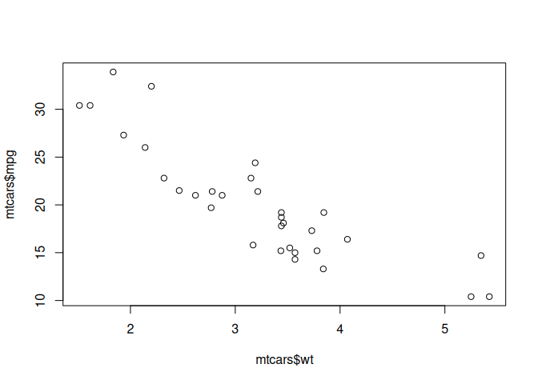
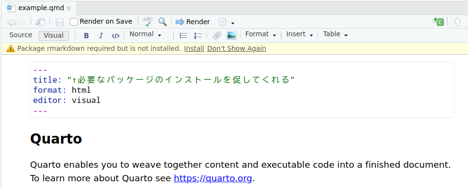
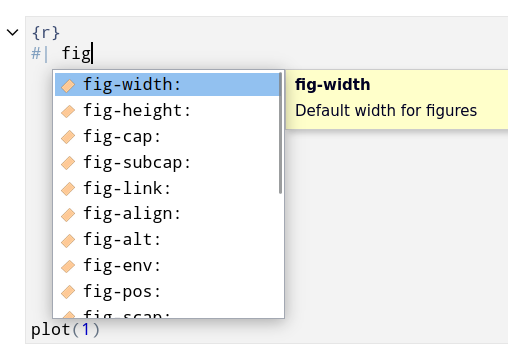
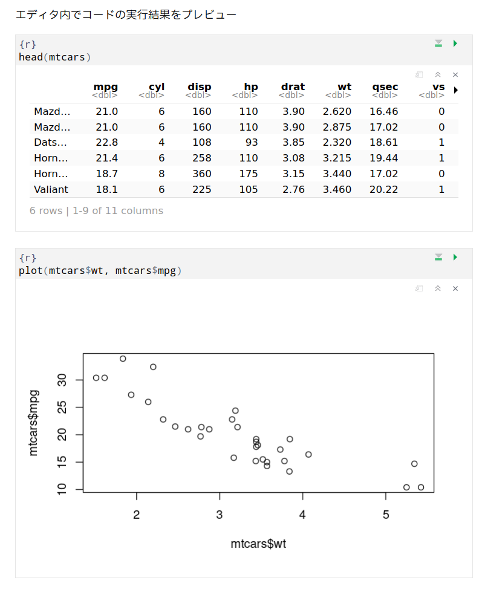
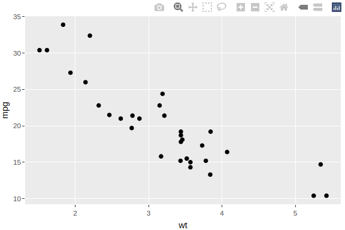
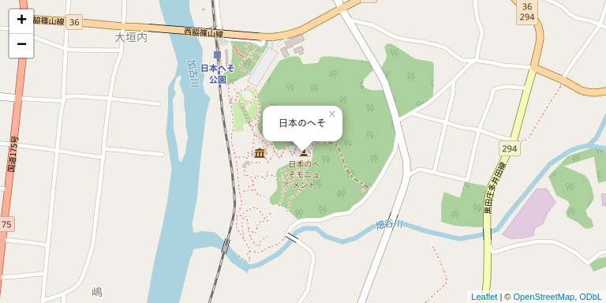
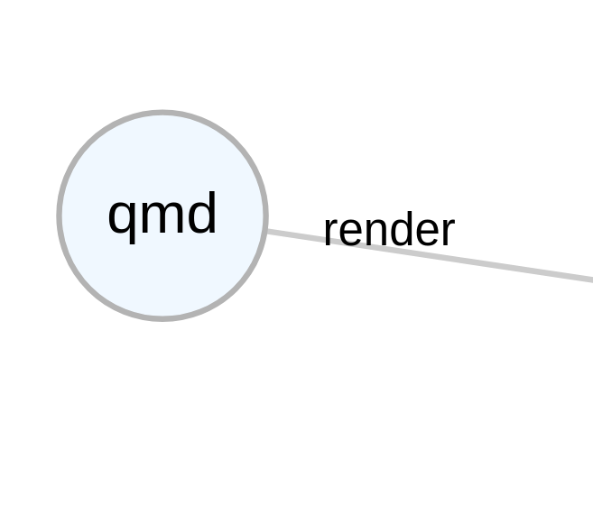
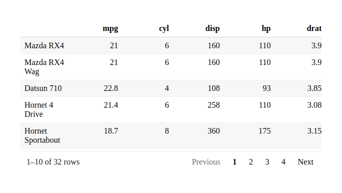

# 分析ノートから始めるQuarto
Atusy

# Atusy


## 属性

- Rパッケージ作ったりメンテしたり
  - 代表作
    - [felp](https://felp.atusy.net)：`fuzzyhelp()`でヘルプを曖昧検索
    - [ftExtra](https://ftextra.atusy.net)：flextable ❤️ markdown
    - [minidown](https://minidown.atusy.net)：Rmd →
      軽量＆高機能HTMLレポート
  - 関わり深いものに[knitr](https://yihui.org/knitr/)、[rmarkdown](https://rmarkdown.rstudio.com/)など
- 言語: R, Python, lua, bash, Go, TypeScript, …
- エディタ: Neovim

## 著書: [Rが生産性を高める](https://gihyo.jp/book/2022/978-4-297-12524-0)

[](https://gihyo.jp/book/2022/978-4-297-12524-0)

## Links

- blog: <https://blog.atusy.net>
- Twitter: <https://twitter.com/Atsushi776>
- GitHub: <https://github.com/atusy>

# Quarto……？

文書作成をプログラミングできるフレームワーク

レポート・プレゼン・書籍なども作れるが、  
今回は分析ノート作りにフォーカス

<div class=".columns">

<div class="column"
style="display: inline-block; width: 48%; vertical-align: top">

ソース (**qmd**, ipynb, …)

    [1] "/home/atusy/ghq/github.com/atusy/tokyor112-qmd-as-analysis-note/webshot.png"
    attr(,"class")
    [1] "webshot"

</div>

<div class="column"
style="display: inline-block; width: 48%; vertical-align: top">

出力 (**HTML**, Docx, PDF, …)



</div>

</div>

# 分析用Rスクリプトあるある

- 分析結果を管理しにくい
- 考察を管理しにくい
- 人に共有しにくい

Rスクリプトは関数の実装などに使った方がいい

## 分析結果を管理しにくい

- 保存先をどこにしよう？
- 保存されたファイルを信用できるか？
  - 最新か？
  - 再現性はあるか？
  - ファイル名変更に伴うゴミファイルと区別できるか？

## 考察を書きにくい

- どこに書こう？
  - コードコメント？
  - 分析結果に埋め込み？
  - 新しいファイル？
- すぐ書ける場所がないと揮発する

## 人に共有しにくい

- Wordやパワポに貼る……？
  - 更新のたびに貼りなおし

この辺のことは[Rが生産性を高める](https://gihyo.jp/book/2022/978-4-297-12524-0)に書いた

[](https://gihyo.jp/book/2022/978-4-297-12524-0)

## 悲惨な分析状況の例

     📁 docs
     └── mtcars.docx             # output を反映したレポート……のつもりだったもの

     📁 output
     ├── mtcars-summary.csv
     ├── mtcars-wt-vs-mpg.png    # 中身は凡例を読みやすくする前のバージョンのまま
     └── summary.csv             # mtcars-summary.csv に改名して不要になったゴミ

     📁 R
     └── mtcars.R                # 肥大化して mtcars.docx を見ないと
                                   コードごとの分析目的や知見がわからない……
                                   どころか mtcars.docx が腐ってて何もわからない

# そこでQuarto

<https://quarto.org/>

## 雰囲気をつかもう

<div class=".columns">

<div class="column"
style="display: inline-block; width: 48%; vertical-align: top">

ソース (qmd)


</div>

<div class="column"
style="display: inline-block; width: 48%; vertical-align: top">

出力 (HTML)


</div>

</div>

## Quartoで分析ノートを書く

- ソース（qmd）でコードと分析目的や考察を一括管理
  - プレインテキストで読みやすい
- 出力（HTML）に分析結果を追加
  - 最新性・再現性・参照性を確保

# qmdファイルを書く

## qmdファイルとは……？

<div class=".columns">

<div class="column"
style="display: inline-block; width: 60%; vertical-align: top">

- **YAMLフロントマター**
  - タイトルや出力形式などのメタデータ
- **チャンク**
  - コードのかたまり
  - 実行結果が出力に反映される
- **文章**
  - 分析の目的とか考察とか

</div>

<div class="column"
style="display: inline-block; width: 38%; vertical-align: top">


</div>

</div>

## YAMLフロントマター

ドキュメント冒頭の`---`で区切られたメタデータ

分析ノートとしては↓を覚えておけばOK

``` yaml
---
title: "分析ノート"
author: "Atusy"
date: "2024-03-24"
format:
  html:
    embed-resources: true
---
```

💡
`embed-resources: true`を使うと、画像などがHTMLファイルに埋め込まれるため人と共有しやすい

## チャンク

ドキュメント中の```` ```{r} ````と```` ``` ````で囲われた領域

```` markdown
```{r}
plot(mtcars$wt, mtcars$mpg)
```
````



## チャンクオプション

図のサイズなどを調整するオプション。

チャンク冒頭の`#|`で始まるコメント内にYAMLで記述。

`fig-width`と`fig-height`は覚えておきたい。

```` markdown
```{r}
#| fig-width: 4
#| fig-height: 4
plot(mtcars$wt, mtcars$mpg)
```
````

オプション一覧: <https://yihui.org/knitr/options/>

<small>歴史的経緯によりオプション名は`fig.width`などのドット区切りになっているが、Quartoでは`fig-width`のようなハイフン区切りを推奨。</small>

## 文章

Markdown記法を用いて分析の目的や考察などを記述。

``` markdown
# 見出し1

## 見出し1.1

段落。**太字**とか[リンク](https://example.com)とか使える

- 箇条書き
- 記法いろいろ
  - 
  - `code`
  - ...
```

# HTMLに出力する

``` r
quarto::quarto_render("example.qmd")
```

で**example.html**が生成される

# RStudioで始めるQuarto

覚えること多すぎ……💢

更にQuartoのセットアップ方法も覚えるの……？

と思った人もRStudioで始めてみよう

便利機能もいっぱい

## RStudioで楽々セットアップ

- **とりあえずqmdファイルを作ればOK**
  - *File* → *New File* → *Quarto Document…*
- **必要なパッケージのインストールを促してくれる**
  - qmdファイル内で読み込んでるパッケージも対象



## RStudioで覚えることを最小化

- Visualエディタで記法の暗記とサヨナラ

  - 充実のメニューとスラッシュコマンド

- 補完が便利<small style="vertical-align: baseline">（コード・チャンクオプション・YAMLフロントマター）</small>

  

- コマンドパレットも便利（<kbd>Ctrl</kbd>+<kbd>Shift</kbd>+<kbd>P</kbd>）

## RStudioでチャンクをプレビュー



# 分析ノートにべんりなパッケージ

## **plotly**で作る対話的なグラフ

`ggplotly()`だけ覚えておけばOK  
<https://plotly.com/ggplot2/>

``` r
g <- ggplot2::ggplot(mtcars, ggplot2::aes(wt, mpg)) + ggplot2::geom_point()
plotly::ggplotly(g)
```



## **leaflet**で作る対話的な地図

試料採取地点の確認などに  
<https://rstudio.github.io/leaflet/>

<details class="code-fold">
<summary>Code</summary>

``` r
leaflet::leaflet(data.frame(name = '日本のへそ', lng = 135, lat = 35)) |>
  leaflet::addTiles() |>
  leaflet::addPopups(lng = ~ lng, lat = ~ lat, popup = ~ name) |>
  leaflet::setView(lng = 135, lat = 35, zoom = 16)
```

</details>



## **DiagrammeR**で作るダイアグラム

<https://rich-iannone.github.io/DiagrammeR/>

<details class="code-fold">
<summary>Code</summary>

``` r
library(DiagrammeR)
create_graph() %>%
  add_node(label = "qmd") %>%
  add_node(label = "html") %>%
  add_edge(from = "qmd", to = "html", edge_aes = edge_aes(label = "render")) |>
  render_graph()
```

</details>



## **reactable**で作る表

いつでも生データは大事  
そこそこ凝ったこともできる  
<https://glin.github.io/reactable/>

<details class="code-fold">
<summary>Code</summary>

``` r
reactable::reactable(
  mtcars, height = 300, striped = TRUE,
  theme = reactable::reactableTheme(style = list(fontSize = "1rem"))
)
```

</details>



## 表組みいろいろ

- [reactable](https://glin.github.io/reactable/)
  - データを後から見返したい時の第一候補
  - 巨大なデータフレームでもさくさくな印象
- [DT](https://rstudio.github.io/DT/)
  - 数値の範囲などでデータを絞り込みたい時に
  - 巨大なデータフレームに弱い
- [gt](https://gt.rstudio.com/)
  - がっつり表を作り込みたい時に

# プロジェクト管理にべんりな<br>パッケージ

## **renv**でパッケージ管理

パッケージのバージョンに由来する再現しない！を防ぐ

[Rが生産性を高める](https://gihyo.jp/book/2022/978-4-297-12524-0)の第7章でも紹介

[](https://gihyo.jp/book/2022/978-4-297-12524-0)

## **rprojroot**でパス管理

<https://rprojroot.r-lib.org/>

複雑なプロジェクトでは相対パスの指定が大変

**rprojroot**を使えば、相対パスの基準を「プロジェクトのルートディレクトリ」に固定できる

``` r
rprojroot::find_root_file(
  "assets/examles/small-demo.qmd",
  criterion = rprojroot::is_git_root
)
#> [1] "/home/atusy/ghq/github.com/atusy/tokyor112-qmd-as-analysis-note/assets/examles/small-demo.qmd"
```

# もっと良い感じにしたい

分析ノート限定でさえ湧きあがる欲望

- 出力に凝りたい（目次・章番号・相互参照……）
- 変換を高速化したい
- バージョン管理したい
- GitHubでプレビューしたい

## 出力に凝りたい

- 目次が欲しい
  <https://quarto.org/docs/output-formats/html-basics.html#table-of-contents>
- 章番号が欲しい
  <https://quarto.org/docs/output-formats/html-basics.html#section-numbering>
- 相互参照 <https://quarto.org/docs/authoring/cross-references.html>
- ソースコードを隠したい（チャンクオプション）
  - 折り畳み可能にする `#| code-fold: true`
  - 非表示にする `#| echo: false`

## 変換を高速化したい（キャッシュ）

基本はチャンクオプションで`#| cache: true`するだけ

チャンクの内容が同一ならキャッシュした結果を使える

チャンクラベルをつけておくことを強く推奨

```` default
```{r sleep}
#| cache: true
Sys.sleep(10) # キャッシュが効いている間は10秒待たなくていい
print(x)
```
````

期待通りにキャッシュが更新されなかった場合の事故に注意

## 高速化（パッケージ）

- [pins](https://pins.rstudio.com/)
  - リモート上のファイルのキャッシュに便利
  - Rが生産性を高めるでも紹介した
- [targets](https://books.ropensci.org/targets/)
  - コードの依存関係を考慮したキャッシュや並列実行など
  - 依存関係の可視化も可能
  - Rが生産性を高めるでも紹介した
- [memoise](https://memoise.r-lib.org/)
  - 任意の関数にキャッシュ機能をつける
  - 引数ごとに結果をキャッシュし、セッション終了時に破棄する

## バージョン管理

Gitを使おう

> RStudioではじめるGitによるバージョン管理 by uri氏
>
> <https://qiita.com/uri/items/6b94609f156173ed43ed>

## GitHubでプレビューしたい

HTMLファイルはGitHubでは見れない

MarkdownファイルはGitHubでも見れるので、  
出力形式に`gfm`を追加しておくといい

``` yaml
format:
  html: default
  gfm: default
```

**webshot2**をインストールしておくと、  
HTMLウィジェットのスクショもgfmに埋め込める

# ENJOY!!

分析ノート作りにqmd -\> HTMLが便利

- qmdファイル
  - コードと説明文を一括管理できて便利
- qmd -\> HTML
  - qmdの内容にコードの実行結果が加わる
  - 考察と結果の対応関係が簡単にとれて便利
  - 対話的なグラフや地図も使えて見返しやすい

QuartoではWordやPDFへの出力、ウェブサイト作りなどもできるぞ

## Rスクリプトの使いどころ

関数定義はRスクリプトに分離した方がいいことも多い

- `source()`で複数のqmdファイルから使い回せる
- 実装と分析が分離することで可読性が向上する
- パッケージ化すればテストも実装しやすい
  - バイトコンパイルによる高速化も期待できる
